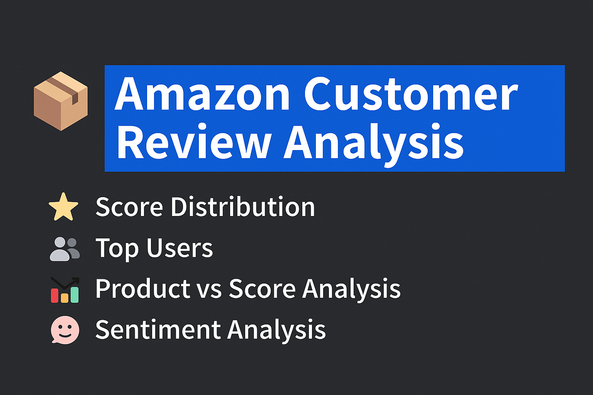

# 📦 Amazon Customer Review Analysis Project  
*Customer Behavior • Sentiment Analysis • Rating Trends • Streamlit Dashboard*

This project provides a complete analysis of **Amazon customer reviews** using Python.  
It includes visual insights, reviewer-type comparison, sentiment analysis, and a Streamlit dashboard.

---

## 📌 Overview  
This analysis focuses on:

- Frequent vs Non-Frequent Reviewer Behavior  
- Score (Rating) Distribution  
- Top Users by Number of Products Purchased  
- Product vs Score Trend Analysis  
- Review Verbosity (Length) Comparison  
- Sentiment Polarity Analysis (Positive / Neutral / Negative)  
- Final **Dashboard Insight Summary**

---

## 📁 Project Structure  
```
├── Images/                                      ← All visualizations (PNG charts)
│     ├── Frequent Users Score.png
│     ├── Not Frequent User Score.png
│     ├── output.png
│     ├── product vs count.png
│     └── Review of users.png
│
├── app.py                                       ← Streamlit dashboard code
├── Amazon CustomerData_Analysis_Pallab.ipynb     ← Full notebook analysis
├── Reviews.csv                                   ← Dataset used
├── requirements.txt                              ← Dependencies
└── README.md                                     ← Project documentation
```

Dataset is included in the project (`Reviews.csv`).

---

## 📊 Visualization Insights  

### ⭐ Score Distribution – Frequent vs Non-Frequent Reviewers  
- Frequent reviewers give more **consistent and higher ratings**  
- Non-frequent users show **mixed and scattered ratings**  

📷 **Frequent Users Score Distribution**  


📷 **Non-Frequent Users Score Distribution** 

 


---

### 👥 Top Users by Products Purchased  
Identifies the **Top 10 most active users** with the highest number of reviewed products.  


---

### 📦 Product vs Score Analysis  
Shows score distribution for products with **500+ reviews**, helping identify trustworthy items.


---

### ✍️ Review Length Analysis  
- Frequent reviewers write **long, descriptive, high-value reviews**  
- Non-frequent reviewers write **shorter, brief comments**  

---

### 💬 Sentiment Polarity Analysis  
Using **TextBlob**, sentiment was classified into:

- **Positive**  
- **Negative**  
- **Neutral**


---

## 📌 Key Insights Summary  

### 🔹 Who Should Be Targeted for Recommendations?  
**Frequent reviewers**, because they:  
- Engage more  
- Write longer and helpful reviews  
- Provide reliable rating patterns  
- Show strong buying behavior  

### 🔹 Behavioral Differences  
| Frequent Users | Non-Frequent Users |
|----------------|--------------------|
| Very positive ratings | Mixed ratings |
| Long, detailed reviews | Short reviews |
| Many purchases | Few purchases |
| High engagement | Low engagement |

### 🔹 Why Frequent Users Matter  
They contribute better text data → better sentiment insights → better product improvements.

---

## ▶️ Running the Streamlit App  

Run the dashboard locally:

```bash
streamlit run app.py
```

---

## 🧩 Installation  
Install dependencies:

```bash
pip install -r requirements.txt
```

Run the notebook:

```bash
jupyter notebook "Amazon CustomerData_Analysis_Pallab.ipynb"
```

---

## 👨‍💻 Author  
**Pallab Sharma**  
Data Analyst | Aspiring AI/ML Engineer  

---

## ⭐ Support  
If you found this project helpful, please ⭐ the repository!
